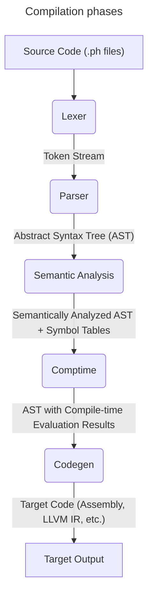

# Compilation Pipeline Specification

This document defines the complete compilation pipeline for the Phaser programming language, detailing the five mandatory phases, their interfaces, data flow, and coordination mechanisms.

This is a **compiler implementation document**. For language design and user-facing features, see the **[docs/](../docs/)** directory.

## Overview

The Phaser compiler implements a strict 5-phase pipeline that processes source code through distinct, well-defined stages. Each phase has clear responsibilities, inputs, and outputs, ensuring separation of concerns and enabling incremental compilation.

## Pipeline Architecture



## Phase Interfaces

### Phase 1: Lexical Analysis

**Input**: Raw source text (`&str` or `SourceFile`)
**Output**: Token stream (`TokenStream`)

```rust
pub struct LexerPhase;

impl CompilerPhase for LexerPhase {
    type Input = SourceFile;
    type Output = TokenStream;
    type Error = LexicalError;
    
    fn execute(&mut self, input: Self::Input) -> PhaserResult<Self::Output> {
        let mut lexer = Lexer::new(input);
        lexer.tokenize()
    }
}

pub struct TokenStream {
    pub tokens: Vec<Token>,
    pub source_map: SourceMap,
    pub errors: Vec<PhaserError>,
}
```

**Responsibilities**:
- Convert source text into tokens
- Handle string and numeric literal parsing
- Track source positions for error reporting
- Process comments and whitespace as trivia
- Detect and report lexical errors

### Phase 2: Syntactic Analysis

**Input**: Token stream (`TokenStream`)
**Output**: Abstract Syntax Tree (`Program`)

```rust
pub struct ParserPhase;

impl CompilerPhase for ParserPhase {
    type Input = TokenStream;
    type Output = ParseResult;
    type Error = SyntaxError;
    
    fn execute(&mut self, input: Self::Input) -> PhaserResult<Self::Output> {
        let mut parser = Parser::new(input);
        parser.parse_program()
    }
}

pub struct ParseResult {
    pub program: Program,
    pub errors: Vec<PhaserError>,
    pub warnings: Vec<PhaserError>,
}
```

**Responsibilities**:
- Build Abstract Syntax Tree from tokens
- Implement error recovery for continued parsing
- Validate syntactic correctness
- Handle operator precedence and associativity
- Preserve source location information in AST nodes

### Phase 3: Semantic Analysis

**Input**: AST (`Program`)
**Output**: Analyzed AST with symbol tables (`AnalysisResult`)

```rust
pub struct AnalysisPhase;

impl CompilerPhase for AnalysisPhase {
    type Input = ParseResult;
    type Output = AnalysisResult;
    type Error = SemanticError;
    
    fn execute(&mut self, input: Self::Input) -> PhaserResult<Self::Output> {
        let mut analyzer = SemanticAnalyzer::new();
        analyzer.analyze(input.program)
    }
}

pub struct AnalysisResult {
    pub program: Program,
    pub symbol_table: SymbolTable,
    pub type_table: TypeTable,
    pub dependency_graph: DependencyGraph,
    pub errors: Vec<PhaserError>,
    pub warnings: Vec<PhaserError>,
}
```

**Responsibilities**:
- Name resolution and scope analysis
- Type checking and inference
- Borrow checking and lifetime analysis
- Dead code detection
- Dependency analysis
- Build symbol and type tables

### Phase 4: Compile-time Evaluation

**Input**: Analyzed AST (`AnalysisResult`)
**Output**: AST with comptime results (`ComptimeResult`)

```rust
pub struct ComptimePhase;

impl CompilerPhase for ComptimePhase {
    type Input = AnalysisResult;
    type Output = ComptimeResult;
    type Error = ComptimeError;
    
    fn execute(&mut self, input: Self::Input) -> PhaserResult<Self::Output> {
        let mut evaluator = ComptimeEvaluator::new(input.symbol_table);
        evaluator.evaluate(input.program)
    }
}

pub struct ComptimeResult {
    pub program: Program,
    pub comptime_values: ComptimeValueTable,
    pub generated_code: Vec<GeneratedItem>,
    pub meta_expansions: Vec<MetaExpansion>,
    pub errors: Vec<PhaserError>,
}
```

**Responsibilities**:
- Execute compile-time expressions and functions
- Perform constant folding and propagation
- Execute meta-programming directives
- Generate code from templates
- Validate comptime constraints and limits

### Phase 5: Code Generation

**Input**: Comptime-evaluated AST (`ComptimeResult`)
**Output**: Target code (`CodegenResult`)

```rust
pub struct CodegenPhase;

impl CompilerPhase for CodegenPhase {
    type Input = ComptimeResult;
    type Output = CodegenResult;
    type Error = CodegenError;
    
    fn execute(&mut self, input: Self::Input) -> PhaserResult<Self::Output> {
        let mut codegen = CodeGenerator::new(self.target_config);
        codegen.generate(input.program)
    }
}

pub struct CodegenResult {
    pub output: TargetOutput,
    pub debug_info: DebugInfo,
    pub metadata: CompilationMetadata,
}

pub enum TargetOutput {
    Assembly(String),
    LlvmIr(String),
    ObjectCode(Vec<u8>),
    Executable(Vec<u8>),
}
```

**Responsibilities**:
- Generate target-specific code
- Perform target-specific optimizations
- Generate debug information
- Handle linking and symbol resolution
- Produce final executable or library

## Pipeline Coordination

### Compiler Driver

```rust
pub struct Compiler {
    config: CompilerConfig,
    source_manager: SourceManager,
    error_reporter: ErrorReporter,
}

impl Compiler {
    pub fn compile(&mut self, sources: Vec<SourceFile>) -> PhaserResult<CompilationResult> {
        let mut results = Vec::new();
        
        for source in sources {
            let result = self.compile_single(source)?;
            results.push(result);
        }
        
        self.link_results(results)
    }
    
    fn compile_single(&mut self, source: SourceFile) -> PhaserResult<ModuleResult> {
        // Phase 1: Lexical Analysis
        let mut lexer_phase = LexerPhase::new();
        let tokens = lexer_phase.execute(source)?;
        
        // Phase 2: Syntactic Analysis
        let mut parser_phase = ParserPhase::new();
        let parse_result = parser_phase.execute(tokens)?;
        
        // Phase 3: Semantic Analysis
        let mut analysis_phase = AnalysisPhase::new();
        let analysis_result = analysis_phase.execute(parse_result)?;
        
        // Phase 4: Compile-time Evaluation
        let mut comptime_phase = ComptimePhase::new();
        let comptime_result = comptime_phase.execute(analysis_result)?;
        
        // Phase 5: Code Generation
        let mut codegen_phase = CodegenPhase::new(self.config.target);
        let codegen_result = codegen_phase.execute(comptime_result)?;
        
        Ok(ModuleResult {
            source_id: source.id,
            output: codegen_result,
        })
    }
}
```

### Phase Interface Trait

```rust
pub trait CompilerPhase {
    type Input;
    type Output;
    type Error: Into<PhaserError>;
    
    fn execute(&mut self, input: Self::Input) -> PhaserResult<Self::Output>;
    
    fn phase_name(&self) -> &'static str;
    fn can_recover_from_error(&self) -> bool { false }
    fn cleanup(&mut self) {}
}
```

## Data Flow and Dependencies

### Inter-Phase Data

```rust
pub struct CompilationContext {
    pub source_manager: SourceManager,
    pub symbol_tables: HashMap<ModuleId, SymbolTable>,
    pub type_tables: HashMap<ModuleId, TypeTable>,
    pub dependency_graph: GlobalDependencyGraph,
    pub comptime_cache: ComptimeCache,
    pub target_config: TargetConfig,
}
```

### Incremental Compilation Support

```rust
pub struct IncrementalCompiler {
    cache: CompilationCache,
    dependency_tracker: DependencyTracker,
}

impl IncrementalCompiler {
    pub fn compile_incremental(
        &mut self,
        changed_files: Vec<SourceFile>,
    ) -> PhaserResult<CompilationResult> {
        // Determine which modules need recompilation
        let affected_modules = self.dependency_tracker
            .find_affected_modules(&changed_files);
        
        // Recompile only affected modules
        for module in affected_modules {
            if !self.cache.is_valid(&module) {
                self.recompile_module(module)?;
            }
        }
        
        self.link_cached_results()
    }
}
```

## Error Handling Across Phases

### Error Propagation

```rust
pub struct PhaseError {
    pub phase: PhaseName,
    pub error: PhaserError,
    pub can_continue: bool,
}

#[derive(Debug, Clone, PartialEq)]
pub enum PhaseName {
    Lexer,
    Parser,
    Analysis,
    Comptime,
    Codegen,
}

impl Compiler {
    fn handle_phase_error(&mut self, error: PhaseError) -> PhaserResult<()> {
        self.error_reporter.report_error(&error.error);
        
        if error.can_continue {
            // Continue with next phase using error recovery
            Ok(())
        } else {
            // Fatal error, stop compilation
            Err(error.error)
        }
    }
}
```

### Error Recovery Strategies

1. **Lexer Recovery**: Skip invalid characters, continue tokenizing
2. **Parser Recovery**: Synchronize to statement boundaries, insert missing tokens
3. **Analysis Recovery**: Use error types, continue with partial information
4. **Comptime Recovery**: Skip failed evaluations, use default values
5. **Codegen Recovery**: Generate placeholder code, emit warnings

## Performance Optimization

### Parallel Compilation

```rust
pub struct ParallelCompiler {
    thread_pool: ThreadPool,
    dependency_graph: DependencyGraph,
}

impl ParallelCompiler {
    pub fn compile_parallel(&mut self, modules: Vec<Module>) -> PhaserResult<CompilationResult> {
        let compilation_order = self.dependency_graph.topological_sort();
        let mut futures = Vec::new();
        
        for batch in compilation_order.into_batches() {
            let batch_futures: Vec<_> = batch.into_iter()
                .map(|module| self.compile_module_async(module))
                .collect();
            
            futures.extend(batch_futures);
        }
        
        // Wait for all compilations to complete
        let results = futures::future::join_all(futures).await;
        self.combine_results(results)
    }
}
```

### Caching Strategy

```rust
pub struct CompilationCache {
    lexer_cache: HashMap<SourceId, TokenStream>,
    parser_cache: HashMap<SourceId, ParseResult>,
    analysis_cache: HashMap<ModuleId, AnalysisResult>,
    comptime_cache: HashMap<ComptimeKey, ComptimeValue>,
}

impl CompilationCache {
    pub fn get_or_compute<T, F>(&mut self, key: &CacheKey, compute: F) -> PhaserResult<T>
    where
        F: FnOnce() -> PhaserResult<T>,
        T: Clone + Serialize + DeserializeOwned,
    {
        if let Some(cached) = self.get(key) {
            Ok(cached)
        } else {
            let result = compute()?;
            self.insert(key.clone(), result.clone());
            Ok(result)
        }
    }
}
```

## Configuration and Targets

### Compiler Configuration

```rust
pub struct CompilerConfig {
    pub target: TargetConfig,
    pub optimization_level: OptimizationLevel,
    pub debug_info: DebugInfoLevel,
    pub warnings: WarningConfig,
    pub features: FeatureConfig,
    pub paths: PathConfig,
}

pub struct TargetConfig {
    pub architecture: Architecture,
    pub operating_system: OperatingSystem,
    pub environment: Environment,
    pub code_model: CodeModel,
}

#[derive(Debug, Clone, PartialEq)]
pub enum OptimizationLevel {
    None,       // -O0
    Size,       // -Os
    Speed,      // -O2
    Aggressive, // -O3
}
```

### Multi-Target Support

```rust
pub trait CodegenBackend {
    fn generate_code(&mut self, program: &Program) -> PhaserResult<TargetOutput>;
    fn target_info(&self) -> &TargetInfo;
    fn supported_features(&self) -> &[Feature];
}

pub struct LlvmBackend {
    context: LlvmContext,
    module: LlvmModule,
    target_machine: TargetMachine,
}

pub struct NativeBackend {
    assembler: Assembler,
    linker: Linker,
}
```

## Testing and Validation

### Pipeline Testing

```rust
#[cfg(test)]
mod pipeline_tests {
    use super::*;
    
    #[test]
    fn test_complete_pipeline() {
        let source = r#"
            fn main() -> i32 {
                let x = 42;
                return x;
            }
        "#;
        
        let mut compiler = Compiler::new(CompilerConfig::default());
        let result = compiler.compile_string(source).unwrap();
        
        assert!(result.is_success());
        assert!(!result.output.is_empty());
    }
    
    #[test]
    fn test_error_recovery() {
        let source = r#"
            fn main() {
                let x = ; // Syntax error
                let y = 42; // Should still compile
            }
        "#;
        
        let mut compiler = Compiler::new(CompilerConfig::default());
        let result = compiler.compile_string(source);
        
        assert!(result.has_errors());
        assert!(result.has_partial_output());
    }
}
```

### Integration Testing

- End-to-end compilation tests
- Cross-phase error propagation tests
- Performance regression tests
- Memory usage validation
- Incremental compilation correctness

## Future Extensions

### Planned Enhancements

1. **Language Server Integration**: Real-time compilation for IDE support
2. **Hot Reloading**: Runtime code replacement for development
3. **Cross-Compilation**: Support for multiple target platforms
4. **Plugin System**: Extensible compilation phases
5. **Distributed Compilation**: Network-based parallel compilation
6. **Advanced Caching**: Persistent cross-session caching
7. **Profile-Guided Optimization**: Runtime feedback for optimization

### Extensibility Points

- Custom lexer extensions for domain-specific syntax
- Parser plugins for language extensions
- Analysis passes for custom linting rules
- Comptime function libraries
- Backend plugins for new target platforms